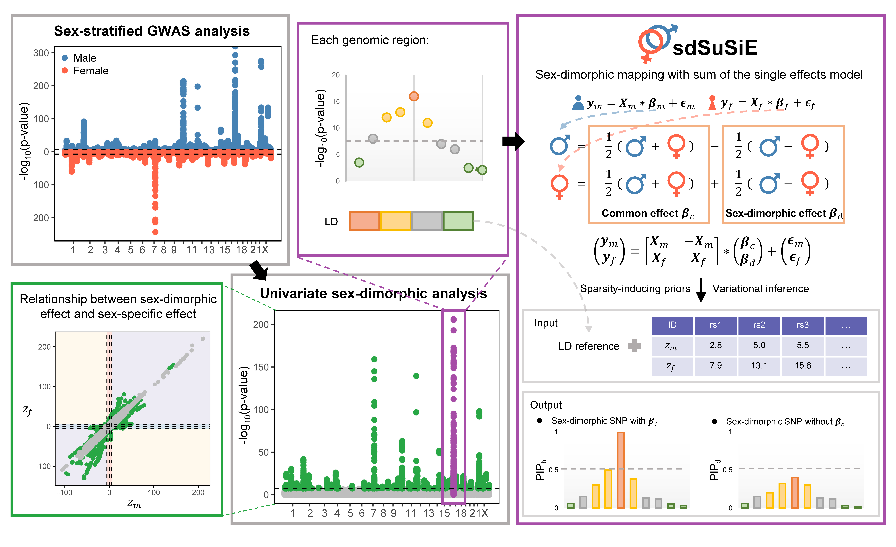

# sdSuSiE

sdSuSiE (Sex-dimorphic mapping with sum of the single effects model) is a package designed for sex-dimorphic fine-mapping using summary statistics from sex-stratified genome-wide association studies (GWAS). sdSuSiE explicitly models sex-specific genetic effects while incorporating shared genetic effects across sexes. It properly accounts for linkage disequilibrium (LD) patterns across different types of genetic effects and extends the SuSiE framework to sex-dimorphic fine-mapping. As a result, sdSuSiE provides calibrated credible set coverage and posterior inclusion probabilities (PIPs). 

## Installation
It is easy to install the development version of sdSuSiE package using the 'devtools' package. 

```
# install.packages("devtools")
library(devtools)
install_github("yuanzhongshang/sdSuSiE")
```
## Usage
The main function in the package is sdSuSiE, you can find the instructions by '?sdSuSiE'.
```
library(sdSuSiE)

?sdSuSiE
```

## Quick Start

See [Tutorial](https://yuanzhongshang.github.io/sdSuSiE/) for detailed examples.                                                                                                                      

## Development
This R package is developed by Lu Liu, Zhongshang Yuan and Xiang Zhou.
