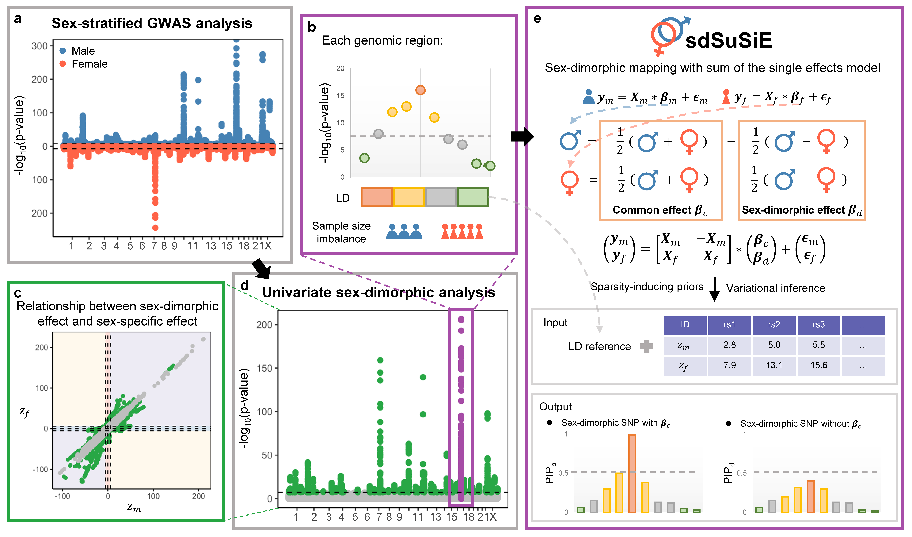

# sdSuSiE

sdSuSiE (Sex-dimorphic mapping with sum of the single effects model) is a package designed for sex-dimorphic fine-mapping using summary statistics from sex-stratified genome-wide association studies (GWAS). sdSuSiE explicitly models sex differences in genetic effects while accounting for correlations induced by linkage disequilibrium and sample size imbalances between sexes. It uses summary statistics from sex-stratified GWASs as inputs and extends the recent scalable variational inference algorithm SuSiE to fine-map sex-dimorphic effects. As a result, sdSuSiE provides calibrated credible set coverage and posterior inclusion probabilities (PIPs). 

## Installation
It is easy to install the development version of sdSuSiE package using the 'devtools' package. 

```
# install.packages("devtools")
library(devtools)
install_github("yuanzhongshang/sdSuSiE")
```

## Usage
The main function in the package is sdSuSiE, you can find the instructions by '?sdSuSiE'.
```
library(sdSuSiE)

?sdSuSiE
```

## Quick Start

See [Tutorial](https://yuanzhongshang.github.io/sdSuSiE/) for detailed examples.            

## Development
This R package is developed by Lu Liu, Zhongshang Yuan and Xiang Zhou.
