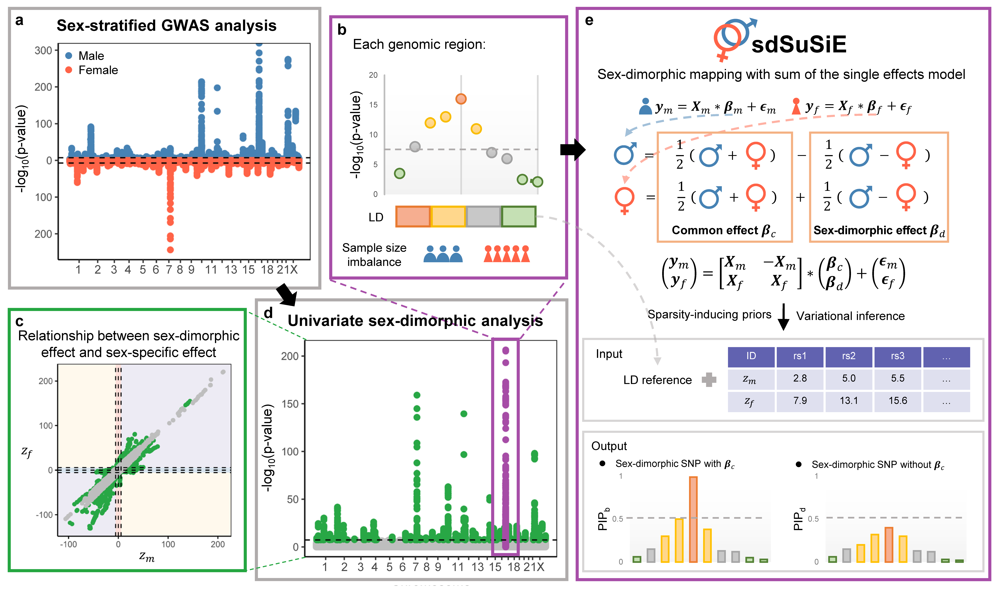

## sdSuSiE Overview

sdSuSiE is a package designed for sex-dimorphic fine-mapping using summary statistics from sex-stratified genome-wide association studies (GWAS). sdSuSiE explicitly models sex-specific genetic effects while incorporating shared genetic effects across sexes. It properly accounts for linkage disequilibrium (LD) patterns across different types of genetic effects and extends the SuSiE framework to sex-dimorphic fine-mapping. As a result, sdSuSiE provides calibrated credible set coverage and posterior inclusion probabilities (PIPs). 

Installation
------------
You can install the released version of sdSuSiE from Github with the following code, for more installation details or solutions that might solve related issues (specifically MacOS system) see the [link](https://yuanzhongshang.github.io/sdSuSiE/documentation/02_installation.html).

### Dependencies 
* R version >= 3.5.0.
* R packages: R6, nloptr, cowplot, dplyr, ggplot2, ggrepel, Rcpp, RcppArmadillo, parallel, doParallel, foreach


### 1. Install `devtools` if necessary
```r
install.packages('devtools')
```

### 2. Install `sdSuSiE`
```r
devtools::install_github('yuanzhongshang/sdSuSiE')
```
### 3. Load package
```r
library(sdSuSiE)
```

This package is supported for Windows 10, MAC and Linux. The package has been tested on the following systems:
- Windows 10
- MAC: OSX (10.14.1)
- Linux: Ubuntu (16.04.6)

### Issues
All feedback, bug reports and suggestions are warmly welcomed! Feel free to leave messages on the [github issues](https://github.com/yuanzhongshang/sdSuSiE/issues). Please make sure to raise issues with a detailed and reproducible example and also please provide the output of your sessionInfo() in R! 

How to cite `sdSuSiE`
-------------------
Lu Liu, Zhongshang Yuan, Xiang Zhou, Conditional transcriptome-wide association study for fine-mapping candidate causal genes, 2025.

How to use `sdSuSiE`
-------------------
A quick guide with an example analysis: [here](https://yuanzhongshang.github.io/sdSuSiE/documentation/03_A_Quick_Guide.html).
